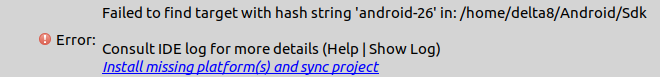

# Intel Delta 8 course practice

[](https://gitter.im/intel_delta8/Lobby?utm_source=badge&utm_medium=badge&utm_campaign=pr-badge&utm_content=badge) [](https://gitpitch.com/dkurt/delta8)

Intel Delta 8 course practice

## Prerequisites
### Android Studio
1. Download and install Adnroid Studio from https://developer.android.com/studio
1. Create a new project. Keep default settings.
1. Probably you'll face a error similar to the following:

  

  Click onto highlighted link to resolve it. Then you may see the next one error:

  

  Resolve it in the same way.

1. Plug in USB cable connected to device. Make sure that Developers Mode on the
device is enabled. You may find an appropriate instructions for your version of OS.

1. Authorize an Android device.

  * Ubuntu
    1. Install Android Debug Bridge
    ```
    $ sudo apt-get install adb
    ```
    1. Check device id
    ```
    $ lsusb
    Bus 003 Device 008: ID 1bbb:9018 T & A Mobile Phones
    ```

    1. Add the following line to `/etc/udev/rules.d/51-android.rules` (create it
    if there is no file). The first 4 symbols are vendor's id and
    the last one are product's id:
    ```
    SUBSYSTEM="usb", ATTRS{idVendor}=="1bbb", ATTRS{idProduct}=="9018", MODE=="0666"
    ```
    Note that `sudo` directive may be required. Apply
    `sudo chmod a+rw /etc/udev/rules.d/51-android.rules` after all above.

    1. Restart `adb` service. Probably, connection should be permitted from the
    device side (notification will appear). Check that device is detected by `adb devices`.
    ```
    $ sudo adb kill-server && sudo adb start-server && sudo adb devices
    List of devices attached
    PEJB25BF4MXAHN4 device
    ```
    1. In case of undetected device problem at Android Studio or permissions
    problems just restart `adb` again and make sure that device is detected.

  * Windows
    1. No specific settings are required (tested on Windows 10).

1. Launch a project on device by `Run->Run 'app'`. Select detected device.

  

### Python
1. Python
1. NumPy
  * `sudo apt-get install python-pip && sudo pip install numpy` for Ubuntu

### OpenCV
1. Download OpenCV source code from https://github.com/opencv/opencv or using git:
```bash
git clone https://github.com/opencv/opencv --depth 1
```

1. Create a folder for OpenCV's build.
```bash
cd /path/to/opencv
mkdir build && cd build
```

1. Build OpenCV.

  * Ubuntu
  ```bash
  cmake -DCMAKE_BUILD_TYPE=Release -DBUILD_LIST=dnn,python2,videoio,highgui /path/to/opencv && make -j4
  ```

  * Windows

    ```bash
    "C:\Program Files\CMake\bin\cmake.exe" ^
        -DCMAKE_BUILD_TYPE=Release ^
        -DBUILD_LIST=dnn,python2,videoio,highgui ^
        -G "Visual Studio 14 Win64" /path/to/opencv

    "C:\Program Files\CMake\bin\cmake.exe" --build . --config Release -- /m:4
    ```

### Test Python and OpenCV
```python
import cv2 as cv

img = cv.imread('/path/to/example.png')
cv.imshow('Hello!', img)
cv.waitKey()
```
